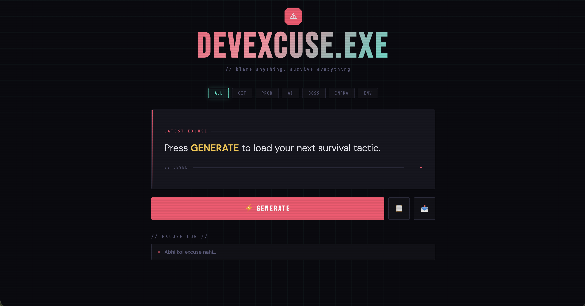

# ⚠️ DevExcuse.exe

> *"It works on my machine."* — Every Developer, Always.

**A dark-themed Developer Excuse Generator** — because bugs deserve better explanations.

🔴 **Live Demo → [devexcuse.tech](https://raunak2810.github.io/Devexcuse-/)**

---



---

## ✨ Features

- ⚡ **Instant Excuse Generator** — one click, infinite survival
- 📊 **BS Level Meter** — rates how believable your excuse is (spoiler: never 100%)
- 🗂️ **Categories** — Git, Prod, AI, Boss, Infra, Env
- 📋 **Copy to Clipboard** — paste directly into Slack before your manager reads this
- 📤 **WhatsApp Share** — send to teammates who also need excuses
- 🕘 **Excuse Log** — tracks your last 5 lies
- ⌨️ **Keyboard Shortcut** — hit `Space` for a new excuse
- 💡 **Rotating Dev Quotes** — because one cheesy line is never enough

---

## 🛠️ Built With


- Pure **HTML + CSS + JS** — zero frameworks, zero dependencies
- Google Fonts: `Bebas Neue`, `Share Tech Mono`, `DM Sans`
- Deployed via **GitHub Pages**

---

## 📁 Project Structure

```
devexcuse/
├── index.html    ← Structure + Footer
├── style.css     ← Dark theme, animations, grid bg
└── script.js     ← Excuse data + all logic
```

---

## 🚀 Run Locally

```bash
git clone https://github.com/Raunak2810/Devexcuse-.git
cd Devexcuse-
# Just open index.html in your browser
open index.html
```

No npm. No build step. No existential crisis.

---

## 🤝 Contributing

Got a better excuse? PRs are welcome.

```bash
# Add your excuse in script.js under the right category
# Format:
{ text: "Your excuse with <em>highlighted part</em>", bs: 75 }
```

---

## 📜 License

MIT — steal freely, commit responsibly.

---

<div align="center">

crafted with ❤️ & ☕ by **[Raunak Mishra](https://github.com/Raunak2810)**

*// git blame won't find him. he's too smart for that.*

</div>
